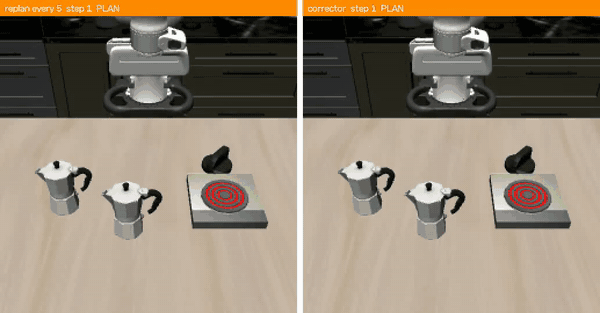
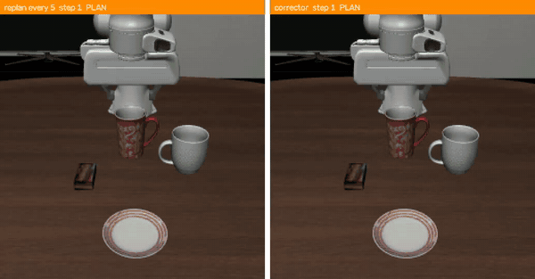
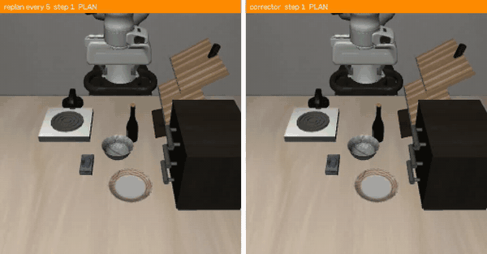
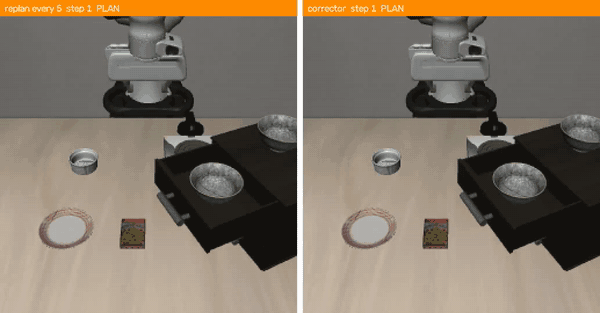
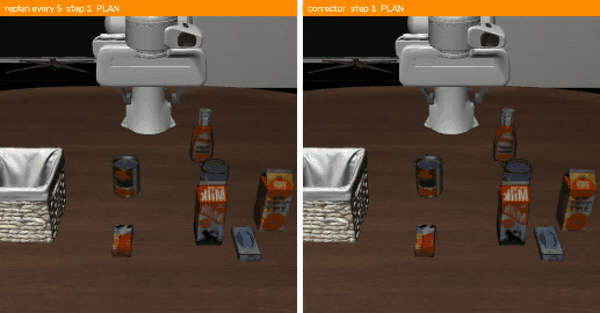

# Why Plan From Scratch? Accelerating Diffusion VLAs Via Trajectory Recycling (WPFS)

Accelerating a flow-matching VLA by **refining its own stale action chunk** instead
of replanning from noise, with a self-verifying test that decides how long each
refinement may be trusted, and a small **distilled student** that makes a
refinement ~6.5× cheaper than a plan.

The policy is used unmodified and frozen throughout; only the corrector changes.
Results cover **π0.5** (openpi's official `pi05_libero`, 10-action chunk) on all
four LIBERO suites, and **π0** on LIBERO-Spatial further down.

## Results: π0.5 on LIBERO

Standard protocol: every suite, 10 tasks × all 50 initial states, seed 7. Every
episode draws its noise from `(seed, task, trial)`, so all rows run **the same
500 episodes per suite** and are compared **pair by pair** (McNemar). Speedup is
the default's latency per control step over the method's.

| method | Spatial | Object | Goal | Long | average |
|---|---|---|---|---|---|
| π0.5, replan every 5 (openpi default) | 98.6 (1.00×) | 98.8 (1.00×) | 98.4 (1.00×) | 94.0 (1.00×) | 97.45 (1.00×) |
| π0.5, replan every 10 (whole chunk) | 98.0 (1.95×) | 99.2 (1.97×) | 97.0 (1.96×) | 94.6 (1.98×) | 97.20 (1.97×) |
| **teacher** corrector (π0.5 itself) | 98.8 (1.85×) | 99.2 (1.92×) | 98.8 (1.85×) | 94.6 (1.69×) | 97.85 (1.83×) |
| **student** corrector (distilled) | **99.0 (4.15×)** | **99.0 (4.10×)** | **98.8 (3.96×)** | **94.4 (3.43×)** | **97.80 (3.91×)** |

Success rate in %, speedup over replan-5 in brackets. The student is at or above
the openpi default on every suite. No row differs from the default
significantly on any suite (paired McNemar, all p ≥ 0.17; for the student
p = 0.77 / 1.00 / 0.77 / 0.87). Against the free 2× of executing the whole
chunk, the student is twice as fast again and 0.6 points more accurate on
average.

**Latency** (one RTX 5090, idle GPU, `torch.compile` default mode):

| one model call | ms |
|---|---|
| plan: prefix + 10 flow steps | 63.0 |
| teacher correction: fresh prefix + 1 step, K = 4 draws | 43.3 |
| student correction: student + 1 step, K = 4 draws | 9.6 |

| ms per control step | Spatial | Object | Goal | Long |
|---|---|---|---|---|
| replan 5 | 12.82 | 12.78 | 12.81 | 12.68 |
| replan 10 | 6.56 | 6.50 | 6.53 | 6.40 |
| teacher | 6.94 | 6.66 | 6.93 | 7.52 |
| student | **3.09** | **3.12** | **3.24** | **3.70** |

Per-step latency is the per-call latency times the calls each run actually made.
On LIBERO-Long the default makes 27,430 plans over the 500 episodes; the student
makes 5,661 plans and 14,838 corrections, and its certificate rejects about as
often as the teacher's (4,257 vs 3,695 rejections).

Per-episode JSON for every row, and the ablations below, are in
`results/pi05/<suite>/`;
`python scripts/paired_table.py results/pi05/libero_10 r5 r10 teacher_L50 student`
prints the paired table.

## Clips

The same initial state under the default (left) and the student corrector
(right). The bar above each frame says where the action being executed came
from: **orange** while a plan's chunk runs, **green** while a correction's does.

| | |
|---|---|
|  | LIBERO-Long, *put both moka pots on the stove*, trial 6. The default fails, the student succeeds. |
|  | LIBERO-Long, *put the white mug on the plate and put the chocolate pudding to the right of the plate*, trial 23 — one of the two tasks the last DAgger round targets. |
|  | LIBERO-Goal, *open the top drawer and put the bowl inside*, trial 1. |
|  | LIBERO-Spatial, *pick up the black bowl in the top drawer of the wooden cabinet and place it on the plate*, trial 21. |
|  | LIBERO-Long task 1, trial 0: both succeed. Most of the student's episode runs on corrections. |

Full-resolution mp4s of both sides are in `videos/pi05/`. Any episode can be
regenerated with `eval_corrector.py --task-ids T --trial-ids K --video-dir DIR`,
because an episode is a deterministic function of `(seed, task, trial)`.

## How it works

**Correction.** The policy's chunk is stale, not wrong. Instead of planning from
noise, take the unexecuted remainder, noise it to τ0 = 0.5 and take **one** flow
step under the fresh observation, K = 4 times with independent noise
(`docs/MECHANISM.md`).

**Certificate.** The K corrected chunks are compared position by position
against the policy's own plan-to-plan spread. A correction is executed for as
long as the draws agree (5 to 10 actions); disagreement, or 50 steps since the
last plan, triggers a fresh plan, whose first 5 actions always run.

**Student.** A 28.7M-parameter transformer replaces the policy inside the
correction. It reads the policy's own prefix embeddings (SigLIP image tokens and
the prompt, 712 tokens) and a state token, plus two inputs the loop already has:

- **plan context** — the action expert's final hidden states for the chunk's 10
  action tokens, computed by the last plan anyway (10 × 1024);
- **plan age** — how many actions have run since that plan.

It is trained by distillation on the teacher's velocity field, never on
demonstrations, with a second loss matching the teacher's per-position draw
spread (the quantity the certificate reads). The first student with both
inputs (st_r8, which also brought a new data round) reached 96.4% on Spatial
where its predecessor without them had 90.6%, and its certificate rejections
halved (2,076 → 1,093).

**Data: DAgger on random scenes.** Every training observation comes from
`env.reset()` scenes under their own seeds, never from the 50 initial states the
evaluation uses. After the first round, which the teacher drives, each round is
driven by the previous student, so the data covers the states the student itself
reaches:

```
round  driver                    scenes per task      trains
r0     teacher                   20, all suites       st_r0
dg     st_r0                     20                   st_r1  on r0+dg
dg2    st_r1                     20                   st_r2  on r0+dg+dg2
pc     st_r2, + plan context     60                   st_r8  on pc          (--use-plan --use-age)
pd     st_r8                     60                   per-suite fine-tunes of st_r8 on pc+pd, lr 3e-4, 20 epochs
pe     st_long, Long only        60, 120 on tasks 5,7 st_long_pe on pc+pd+pe, lr 3e-4, 20 epochs
```

What the late steps bought, on the same 500 episodes per suite
(`results/pi05/*/abl_*`):

| step | Spatial | Goal | Long |
|---|---|---|---|
| st_r8, one student for all suites | 96.4 | 95.8 | 85.0 |
| per-suite fine-tune, lr 1e-4 | 98.4 | 98.0 | 93.0 |
| per-suite fine-tune, lr 3e-4 | **99.0** | **98.8** | 92.8 |
| + a DAgger round with tasks 5 and 7 oversampled | | | **94.4** |

Twice as many epochs at lr 1e-4 did not help (Goal 97.8), and the validation
error did not predict the lr 3e-4 gain (it ended equal or slightly worse): these
choices were made on evaluation.

## Quickstart

```bash
bash setup/01_environment.sh      # venv + pinned deps
bash setup/02_fetch_sources.sh    # openpi @215abfb, LIBERO @8f1084e
python setup/03b_fetch_pi05.py    # pi05_libero: download, convert to PyTorch
bash setup/03c_fetch_checkpoints.sh  # the trained students (~740 MB, GitHub release)
python setup/04_check.py          # confirms the tree (and loads pi0 if present)
```

Evaluate the trained students (`checkpoints/pi05/`), 10 × 50 per suite:

```bash
bash pipelines/pi05/eval_released.sh libero_spatial      # no argument: all four suites
```

It first measures the latency table on your GPU (`scripts/latency_probe.py`),
since speedups are computed from measured per-call latencies; the reference
measurement is `results/pi05/latency_pi05.json`. One suite takes 20–40 minutes on
one RTX 5090 (Long the longest).

Reproduce the students from scratch, in order. Each stage skips work already
done, so an interrupted stage is simply run again:

```bash
bash pipelines/pi05/00_baselines.sh        # replan 5, replan 10, teacher
bash pipelines/pi05/01_rounds_0_2.sh       # r0, dg, dg2 -> st_r2
bash pipelines/pi05/02_plan_context.sh     # pc -> st_r8 (plan context + age)
bash pipelines/pi05/03_dagger_pd.sh        # pd, st_r8 driving
bash pipelines/pi05/04_suite_finetune.sh   # Spatial, Object, Goal students + evaluation
bash pipelines/pi05/05_long_dagger.sh      # st_long, pe, st_long_pe + evaluation
```

`docs/REPRODUCE.md` has the commands of every stage, with timings and disk use.

## Layout

```
scripts/
  eval_corrector.py      the rollout loop: baseline (--configs baseline --replan N),
                         teacher (no --net), student (--net CKPT);
                         --task-ids / --trial-ids run a subset, --video-dir writes clips
  harvest_dagger.py      DAgger harvest that stores plan context and plan age (rounds pc, pd, pe);
                         --net makes a student drive, --task-trials 5:120,7:120 oversamples tasks
  harvest_distill.py     the harvest without plan context (rounds r0, dg, dg2; and pi0)
  train_net_student.py   the network student: --use-plan --use-age --init-from --lr --mem-noise
  student_net.py         the network, shared by trainer, harvester and evaluation
  latency_probe.py       per-call latency: plan, teacher correction, student correction
  paired_table.py        success, speedup and McNemar pairs against a baseline run
  train_lora_student.py, render_compare.py, stage_latency.py, certificate_diagnostic.py   (pi0)
pipelines/pi05/          the stages above; common.sh holds every path and default
src/sentry/              backend: openpi adapter (pi0 and pi0.5), LIBERO spec, types
setup/                   environment, upstream sources, checkpoint download and conversion
checkpoints/             pi0 students; pi05/: the four pi0.5 students and st_r8 (from 03c_fetch_checkpoints.sh)
results/                 pi0 per-seed JSON; pi05/<suite>/: the runs above
videos/                  pi0 clips; pi05/: the clips above
docs/                    MECHANISM.md, REPRODUCE.md
```

Every path hangs off one root. Scripts default it to the directory containing
`scripts/`; override with `CORRECTOR_HOME=/somewhere/else`.

## π0 on LIBERO-Spatial

| corrector | paired baseline | success | Δ | speedup | ms/step | episodes |
|---|---|---|---|---|---|---|
| π₀, no corrector | — | 96.29 | — | 1.00× | 6.01 | 700 (7 seeds) |
| teacher, full depth | 95.3 | 98.0 | +2.7 | 1.63× | 3.68 | 150 (3 seeds) |
| LoRA student `final30` | 96.4 | 96.4 | +0.0 | 2.05× | 2.93 | 500 (5 seeds) |
| network `spnet`, λ=1 | 96.29 | **97.71** | **+1.43** | **3.12×** | 1.90 | 700 (7 seeds) |

That protocol ran 10 trials per task over 7 seeds, with π₀ replanning every 10
steps of its 50-step chunk; `docs/REPRODUCE.md` keeps its commands.

## Implementation notes

**π0.5 is not π0 at the interface.** Its LIBERO checkpoint emits a 10-action
chunk directly in LIBERO's action space, normalised by quantiles, so a stale
chunk is reused as it is. π0 emits a 50-action chunk of deltas against the pose
at planning time; its stale chunk must be re-anchored to the current pose
(`frame_correction()`), and `mark_plan_anchor()` must be called before every
fresh plan. The adapter handles both (`--model pi0 | pi05`).

**Lineage.** A 10-action chunk runs out fast: under the 50-step lineage about two
thirds of corrections run with no planned content left (the tail is padded by
holding the last action). The student has to know this, which is what the
plan-age input is for.

**Evaluation is deterministic per episode.** Each episode seeds its noise from
`(seed, task, trial)`. Rerunning one task of the π0.5 student in a fresh process
reproduced all 50 of its outcomes, which is what makes the paired test and the
`--trial-ids` clips valid. (π0's compiled path was seen to vary across
processes, below; π0.5's did not in that check.)

**Images arrive upside down and mirrored.** LIBERO renders them that way; both
cameras need `[::-1, ::-1]` and then openpi's `resize_with_pad` to 224. A plain
resize changes the aspect ratio and the policy degrades quietly.

**LIBERO blocks on an interactive prompt the first time it is imported.**
`setup/02_fetch_sources.sh` answers it; if you hit `EOFError: EOF when reading a
line`, that step did not run.

**torch.compile.** Compiling `denoise_step` is worth about 1.47× on π0, and every
latency number is measured with it on. Some inductor modes silently move the
sampled chunk, so `eval_corrector.py` tries modes in order and keeps the first
that leaves a fixed-noise plan where it was (`compile[default]: chunk preserved`
in the log; `--compile off` disables it). On π0 the same configuration returned
50/50, 49/50 and 47/50 on one seed across processes; report means over seeds or
paired counts, not a single rate.

## Third-party code

`openpi` (Apache-2.0, Physical Intelligence) and `LIBERO` (MIT) are cloned by
`setup/02_fetch_sources.sh` at the pinned commits, not vendored here. The π₀ and
π0.5 checkpoints are downloaded from `gs://openpi-assets` under their own terms.
