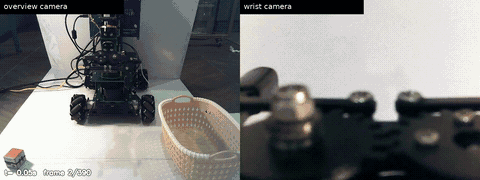
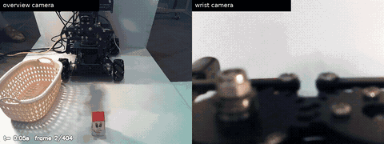
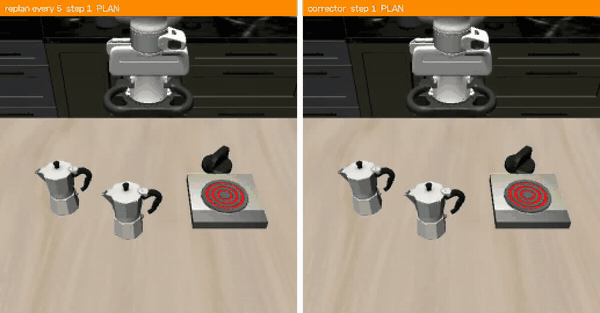
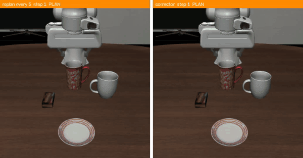
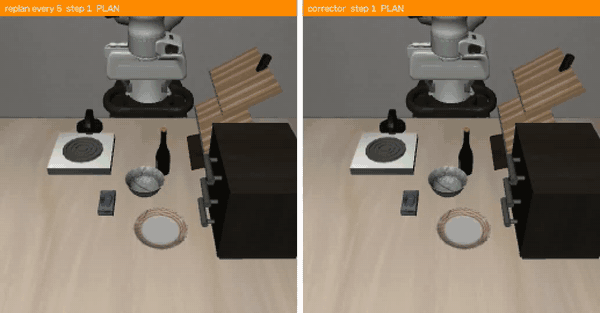
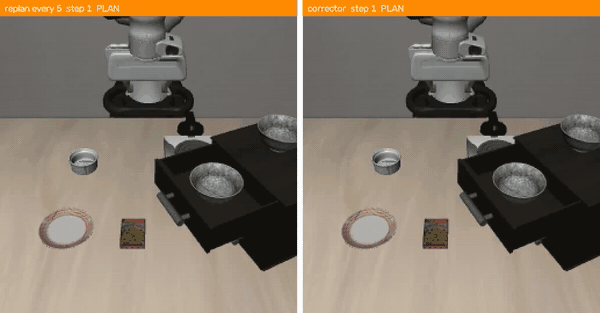
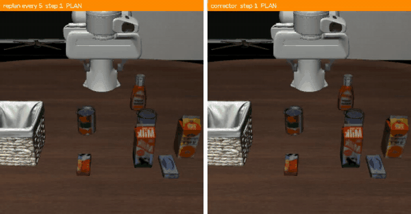

# WPFS: Why Plan From Scratch?

Code, checkpoints and clips for **WPFS**, which accelerates diffusion and
flow-matching Vision-Language-Action policies by **recycling the unexecuted tail of the current
action chunk** instead of replanning from noise. The tail is hold-padded, re-noised to an
intermediate level and corrected in a few solver steps under the fresh observation; K = 4 draws
of that correction are compared against the policy's own plan-to-plan spread, and the longest
prefix on which they agree is executed. A failed check falls back to a full plan.

* **WPFS-Large** uses the frozen policy itself as the corrector; nothing is trained.
* **WPFS-Small** distils the correction into a ~28M-parameter student that re-encodes the current
  images with the policy's frozen vision encoder and skips the language backbone.

The policies are used unmodified and frozen throughout.

## Results

Success rate in %, speedup over the policy's default schedule in the last column. Speedups are
computed from per-call latencies measured on an idle GPU multiplied by the number of calls each
run made.

### LIBERO (10 tasks × 50 initial states per suite, seed 7)

| backbone | method | Spatial | Object | Goal | Long | average | speedup |
|---|---|---|---|---|---|---|---|
| π0 | policy, replan 10 of 50 | 96.0 | 98.4 | 95.6 | 86.2 | 94.1 | 1.00× |
| | SpecPrune-VLA | 95.6 | 98.4 | 93.4 | 83.0 | 92.6 | 1.19× |
| | VLA-Cache | 94.0 | 98.8 | 93.0 | 78.6 | 91.1 | 1.21× |
| | EfficientVLA | 95.6 | 99.0 | 95.6 | 85.6 | 94.0 | 1.34× |
| | AAC | 90.2 | 96.6 | 92.8 | 80.4 | 90.0 | 1.70× |
| | **WPFS-Large** | 95.6 | 99.4 | 94.6 | 89.8 | 94.9 | 1.52× |
| | **WPFS-Small** | 95.6 | 99.0 | 95.6 | 89.8 | 95.0 | **2.95×** |
| π0.5 | policy, replan 5 of 10 | 98.6 | 98.8 | 98.4 | 94.0 | 97.5 | 1.00× |
| | SpecPrune-VLA | 98.0 | 98.4 | 98.4 | 93.6 | 97.1 | 1.25× |
| | VLA-Cache | 97.6 | 98.2 | 98.0 | 93.2 | 96.8 | 1.34× |
| | EfficientVLA | 99.0 | 98.8 | 98.0 | 92.6 | 97.1 | 1.38× |
| | AAC | 98.0 | 99.4 | 97.8 | 93.6 | 97.2 | 1.35× |
| | **WPFS-Large** | 98.8 | 99.2 | 98.8 | 94.6 | 97.9 | 1.83× |
| | **WPFS-Small** | 99.0 | 99.0 | 98.8 | 94.4 | 97.8 | **3.91×** |

### SimplerEnv WidowX/Bridge, DB-OFT (24 scenes × 5 repetitions per task, 480 episodes per row)

| method | Carrot | Spoon | StackCube | Eggplant | average | speedup |
|---|---|---|---|---|---|---|
| DB-OFT, replan 5 of 16, prefix KV cache on | 60.0 | 85.8 | 31.7 | 94.2 | 67.9 | 1.00× |
| SpecPrune-VLA | 59.2 | 85.8 | 30.8 | 92.5 | 67.1 | 1.13× |
| VLA-Cache | 57.5 | 86.7 | 31.7 | 90.8 | 66.7 | 1.02× |
| EfficientVLA | 67.5 | 90.0 | 31.7 | 94.2 | 70.9 | 1.59× |
| AAC | 60.8 | 78.3 | 25.9 | 83.3 | 62.1 | 1.18× |
| **WPFS-Large** | 82.5 | 88.3 | 30.8 | 96.7 | 74.6 | 1.43× |
| **WPFS-Small** | 79.2 | 90.0 | 31.7 | 95.0 | 74.0 | **2.05×** |

The DB-OFT baseline is always run **with the prefix KV cache on** (lossless, 2.11× over the
uncached policy), so no row is credited with the cache.

### Real robot (ROSMASTER X3 Plus, π0.5 fine-tuned on ~600 demonstrations, 40 Hz, 50 trials per task)

| method | static pick | moving 5 cm/s | moving 6 cm/s | average | GPU ms per action | speedup |
|---|---|---|---|---|---|---|
| π0.5 | 76.0 | 28.0 | 0.0 | 34.7 | 18.16 | 1.00× |
| **WPFS-Large** | 78.0 | 82.0 | 16.0 | 58.7 | 9.71 | 1.87× |
| **WPFS-Small** | 76.0 | 98.0 | 50.0 | 74.7 | 4.72 | 3.85× |

| | |
|---|---|
|  | Dynamic interception: the red cube slides across the workspace at constant speed and the arm must reach, grasp and drop it into the basket. Left: overview camera; right: wrist camera. Both are the policy's inputs. |
|  | Static clutter: pick the red cube among distractors and place it in the basket. |

Full-resolution clips are in `videos/real/`.

### Training data and evaluation scenes

* **LIBERO.** Evaluation uses the 50 fixed initial states of every task. The harvest scripts draw
  their training scenes from `env.reset()` under their own seeds (`--random-scenes --scene-seed`,
  a disjoint block per round), never from those initial states.
* **SimplerEnv.** The benchmark ships 24 scenes per task and no training split.
  `scripts/dboft_new_scenes.py` generates 48 training layouts per task by moving and rotating the
  task's own objects inside the original table area, keeping a layout only if simulation agrees
  it is sound: the objects settle without drifting, stay visible to the policy camera and lie at
  least 2.5 cm from every original position. The harvest stages load them through
  `DBOFT_SCENES`; evaluation runs the unmodified 24 scenes.

## Clips (π0.5, LIBERO)

The same initial state under the default schedule (left) and the student corrector (right). The
bar above each frame shows where the executed action came from: **orange** while a plan's chunk
runs, **green** while a correction's does.

| | |
|---|---|
|  | LIBERO-Long, *put both moka pots on the stove*, trial 6: the default fails, the student succeeds. |
|  | LIBERO-Long, *put the white mug on the plate and put the chocolate pudding to the right of the plate*, trial 23. |
|  | LIBERO-Goal, *open the top drawer and put the bowl inside*, trial 1. |
|  | LIBERO-Spatial, *pick up the black bowl in the top drawer of the wooden cabinet and place it on the plate*, trial 21. |
|  | LIBERO-Long task 1, trial 0: both succeed; most of the student's episode runs on corrections. |

Full-resolution mp4s of both sides are in `videos/pi05/`. Any episode can be regenerated with
`scripts/eval_corrector.py --task-ids T --trial-ids K --video-dir DIR`, because an episode is a
deterministic function of `(seed, task, trial)`.

## Repository layout

```
scripts/        the method
  eval_corrector.py      LIBERO rollout loop: baseline (--configs baseline --replan N), WPFS-Large
                         (no --net), WPFS-Small (--net CKPT); --model pi0 | pi05
  harvest_distill.py     harvest of corrections (pi0; pi0.5 rounds r0, dg, dg2)
  harvest_dagger.py      harvest that also stores plan context and plan age (pi0.5 rounds pc, pd, pe)
  train_net_student.py   the LIBERO student trainer; student_net.py is the network
  latency_probe.py       per-call latency: plan, teacher correction, student correction
  paired_table.py        success, speedup and McNemar pairs against a baseline run
  staleness_probe.py, staleness_figure.py   the staleness measurement of the appendix
  dboft_server.py        DB-OFT policy server: --mode baseline | teacher, --student CKPT, --harvest DIR
  dboft_student_net.py, train_dboft_student.py   the DB-OFT student and its trainer
  dboft_new_scenes.py    the 48 SimplerEnv training layouts per task
  dboft_table.py         DB-OFT success, speed and scene-paired comparison
src/sentry/     backend: openpi adapter (pi0 and pi0.5), LIBERO spec, types
pipelines/      pi0/, pi05/, dboft/: the stages behind every released number
baselines/      libero/: SpecPrune-VLA, VLA-Cache, EfficientVLA, AAC on pi0 and pi0.5, with their tables
                dboft/: the same four on DB-OFT (one instrumented server) and their runner
setup/          environments, upstream sources, checkpoint download, client patches
checkpoints/    downloaded by setup/03c_fetch_checkpoints.sh
                pi05/: the four pi0.5 students and st_r8, their common initialisation;
                pi0/, dboft/: the π0 and DB-OFT students (added with the final checkpoints)
data/           inputs the pipelines read: dboft/ (certificate reference spread, training scenes),
                latency/ (the per-call latencies the π0 rows were priced with)
videos/         real/: the two real-robot clips; pi05/: LIBERO clips
docs/           MECHANISM.md, REPRODUCE.md, REPRODUCE_DBOFT.md
```

Every path hangs off one root. Scripts default it to the directory containing `scripts/`;
override it with `CORRECTOR_HOME=/somewhere/else`.

## Quickstart (LIBERO)

```bash
bash setup/01_environment.sh      # venv + pinned deps
bash setup/02_fetch_sources.sh    # openpi, LIBERO at pinned commits
python setup/03_fetch_pi0.py      # pi0_libero: download, convert to PyTorch
python setup/03b_fetch_pi05.py    # pi05_libero: download, convert to PyTorch
bash setup/03c_fetch_checkpoints.sh  # the trained students, from the GitHub release
python setup/04_check.py          # confirms the tree
bash setup/09_baselines.sh        # baselines only: the AAC authors' decision code
```

```bash
bash pipelines/pi05/eval_released.sh libero_spatial   # released pi0.5 student vs replan 5
bash pipelines/pi0/eval.sh libero_spatial             # pi0: replan 10 and WPFS-Large (and WPFS-Small)
bash baselines/libero/run.sh pi05 sp vc ev aac        # the four baselines at their operating points
python baselines/libero/table_pi05.py                 # the pi0.5 table from the runs in ckpt/pi05
python scripts/paired_table.py ckpt/pi05/libero_10 r5 teacher_L50 student
```

DB-OFT and SimplerEnv: `docs/REPRODUCE_DBOFT.md`. Every stage, with timings: `docs/REPRODUCE.md`.


## Third-party code

`openpi` (Apache-2.0), `LIBERO` (MIT), `dexbotic`, `dexbotic-benchmark`, `SimplerEnv` and the AAC
authors' `libero` repository (MIT) are cloned by `setup/` at pinned commits, not vendored. The
π0, π0.5 and DB-OFT checkpoints are downloaded under their own terms. The baselines in
`baselines/` are re-implementations that follow each paper; AAC calls the authors' own
`select_chunk_size`.
